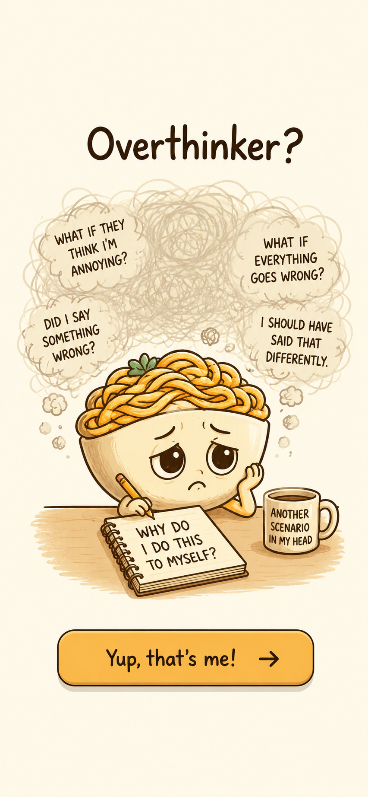
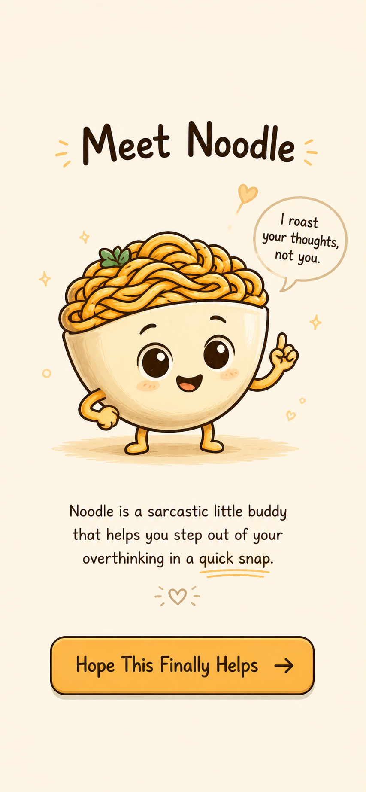
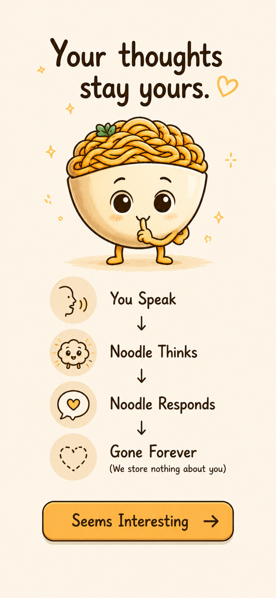
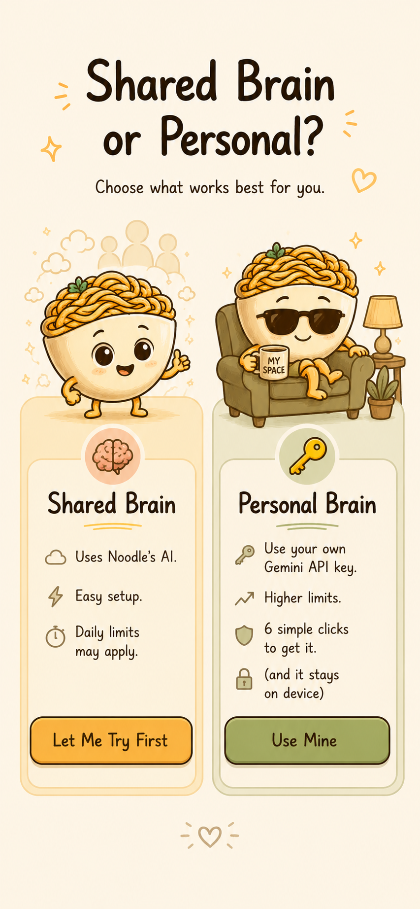

# 🍜 Noodle

> A sarcastic voice companion that helps you stop overthinking, one emotional dump at a time.

Noodle is a privacy-first AI companion designed for people who get stuck in loops of self-doubt, over-analysis, and overthinking.

Instead of maintaining long-term memory or conversation history, Noodle listens to what's bothering you **right now**, responds with a mix of humor and perspective, and then forgets everything.

No journaling.

No emotional archives.

No permanent storage.

Just vent, laugh, and move on.

---

## 📸 Screenshots

### Onboarding Experience

| Screen 1 | Screen 2 |
|----------|----------|
|  |  |

| Screen 3 | Screen 4 |
|----------|----------|
|  |  |

---

## ✨ Vision

Most AI assistants try to remember more about you over time.

Noodle does the opposite.

Its goal is not to become your second brain.

Its goal is to help you get out of your own head.

---

## 🎯 Core Principles

### Privacy First

Noodle never stores emotional dumps permanently.

User input exists only long enough to:

1. Transcribe speech
2. Generate a response
3. Deliver the response

After that, it is discarded.

---

### Lightweight Interaction

No chat threads.

No message history.

No conversation management.

Just:

```text
Press
↓
Rant
↓
Laugh
↓
Continue your day
```

---

### Friendly Sarcasm

Noodle isn't a therapist.

Noodle isn't a life coach.

Noodle is a slightly chaotic friend that occasionally points out when your brain is being ridiculous.

---

## 📱 User Flow

```text
Tap Noodle
↓
Speak your thoughts
↓
Speech → Text
↓
AI Processing
↓
Receive sarcastic response (Text-to-Speech playback)
↓
Everything is forgotten
```

---

## 🏗 Architecture

### Repository Structure

```text
Noodle/
│
├── flutter-app/
│   ├── lib/
│   ├── android/
│   └── ...
│
├── server/
│   ├── main.py
│   ├── services/
│   └── ...
│
├── static/
│   ├── index.html
│   ├── style.css
│   └── script.js
│
└── README.md
```

### Frontend

Built with Flutter using a lightweight feature-based architecture.

**Technologies**

* Flutter
* Riverpod
* GoRouter
* Hive
* Local Device Storage

**Features**

* Onboarding flow
* Floating Noodle companion
* Settings management
* Bring-your-own-key support
* Audio recording and playback

---

### Backend

Built with FastAPI and designed to remain stateless wherever possible.

**Technologies**

* FastAPI
* Gemini API
* REST API
* Rate Limiting
* Temporary Audio Processing

**Services**

* Request validation
* Usage limit checks
* Audio processing
* Response generation
* Statistics tracking

---

## 🌐 Deployment

### Landing Page

The public website is hosted separately from the application backend.

```text
GitHub Pages
        │
        ▼
Landing Page
```

### Backend API

```text
FastAPI
        │
        ▼
AWS Lambda
```

### Mobile App

```text
Flutter APK
        │
        ▼
Gumroad Distribution
```

This separation keeps infrastructure simple, inexpensive, and easy to scale independently.

---

## 📊 Public Statistics

Noodle exposes a lightweight public endpoint that powers the landing page statistics.

Examples:

* Total rants resolved
* Requests processed

No personal user information is included in these metrics.

---

## 🔒 Privacy Model

### Stored Locally

* Onboarding status
* User preferences
* Optional Gemini API key
* Device identifier

### Temporarily Processed

* Voice recordings
* Speech transcripts

These exist only long enough to generate a response and are automatically discarded.

### Never Stored

* Conversation history
* Emotional dumps
* User profiles
* Long-term memories
* Personal journals

Noodle is intentionally designed without persistent memory.

---

## 🧠 Bring Your Own Key (BYOK)

Users may provide their own Gemini API key.

Benefits:

- Higher usage limits
- Reduced dependency on shared infrastructure
- Faster access during high traffic periods

Users can also use the shared Noodle key, subject to rate limits.

---

## ❌ What Noodle Is Not

- A therapist
- A mental health diagnosis tool
- A journaling platform
- A productivity coach
- A memory assistant

---

## 📄 License

This project is currently under development.
License details will be added before public release.